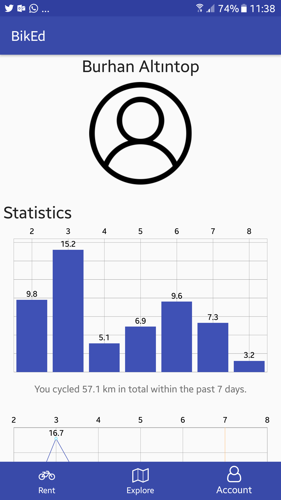

BikED
=====
__Proudly developed in 72h @ [Edinburgh Tourism Innovation Challenge](https://productforge.io/events/edinburgh-tourism-innovation-challenge/)__

What is BikED?
--------------
BikED (pronounced *bike-ed*) is a service -targeting tourists primarily- that offers carefully selected cycling
routes around the town that is safe and pleasant, hence encouraging users to explore the wider city of Edinburgh,
reducing the congestion in the city centre.

BikED the App
-------------
The mobile (Android) app allows users to explore the catalogue of cycling routes, categorised by their difficulty and tagged by the experience they offer, using the interactive map at the top..:

  

...and read the description of a route they are insterested in and view its photos:

  

Users, if they still don't have a bicycle, can see the list of nearest bike rentals using the app..:

  

...and even make a reservation right away, which -at the comfort of the user- can even be delievered to his/her door:

  

Lastly, users can see the statistics about themselves, such as how many kilometres have they cycled so far, and how many
grammes of CO2 have they saved by not taking a car or bus:

  

License
-------
Copyright (C) 2017  [Mert Bora ALPER](mailto:bora@boramalper.org), [Sean MULLAN](mailto:seanmullan97@outlook.com), [Alex BAILLIE](mailto:asgbaillie@gmail.com), [Elena MUSIOL](mailto:elena_ml@hotmail.de)

All rights reserved.
